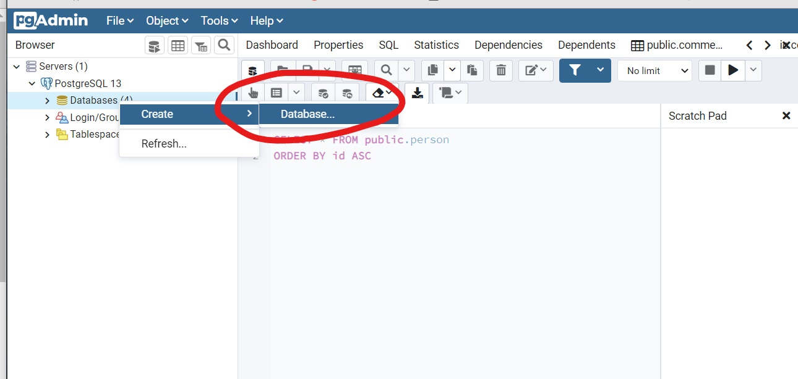
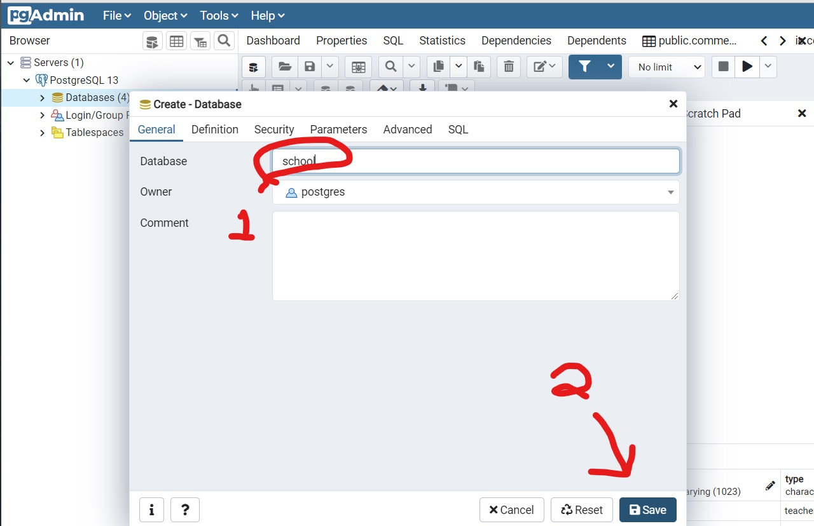
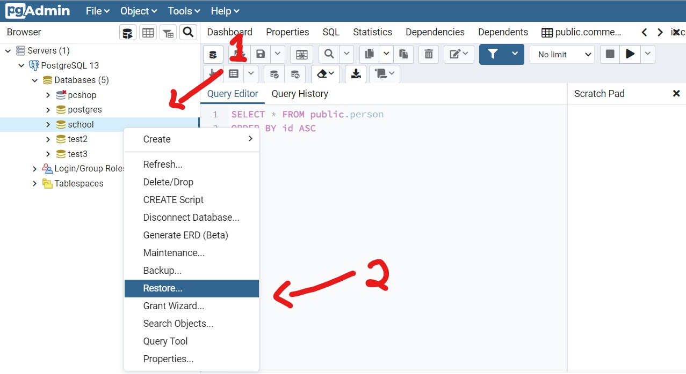
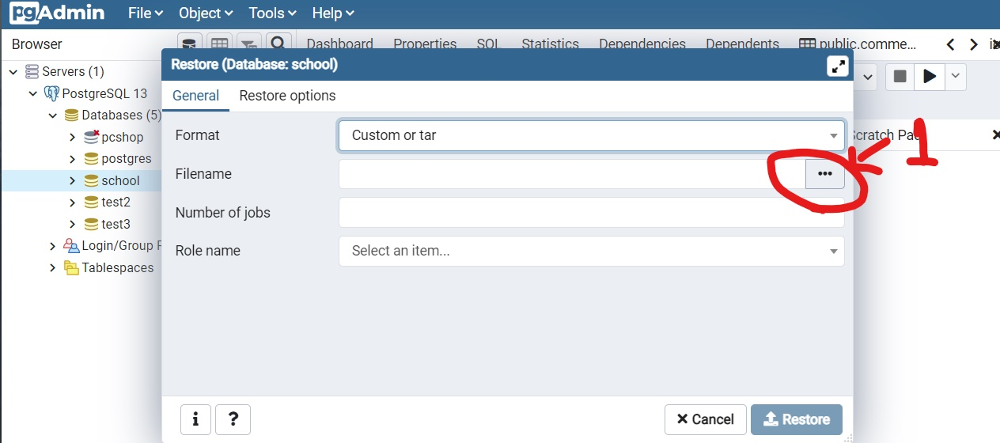
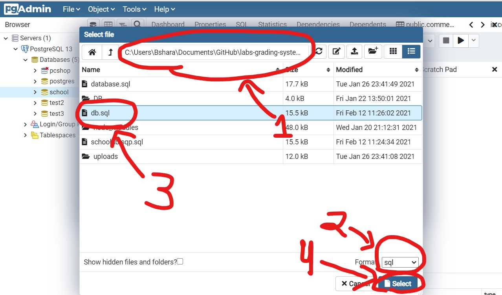

# lab-grading-system-server
## 📝 Table of Contents

- [Instruction for setting up the database](#database)
- [Instruction for running the server](#server)

## Instruction for setting up the database:<a name = "database"></a>
0.1 Download the latest release of [pgAdmin](https://www.pgadmin.org/download/pgadmin-4-windows/)<br>
1.1 Open pgAdmin, right click on ```Databases```, selected ```Create``` and then ```Database...```.

[]()

2.1 Set the database name as ```school```.
2.2 Click on ```save```.

[]()

3.1 Open ```Databases```, right click on ```school```.
3.2 Click on ```Restore...```.

[]()


4.1 Click on ```...``` to select the database file.

[]()

5.1 Browes to the directory of this project.
5.2 Select the ```Format``` as ```sq``` to see the database file ```db.sql```.
5.3 Select the file ```db.sql```.
5.4 Click on ```Select```.

[]()

And that's it, the database is ready!


## Instruction for running the server:<a name = "server"></a>

1. Install dependencies using:<br>
```yarn```<br>
or<br>
```npm install```<br>

1. Download the nodemon package if it doesn't exits, using: <br>
```yarn global nodemon```<br>
or<br>
```npm install -g nodemon```<br>


2. Start the server using the command: ```nodemon start```
